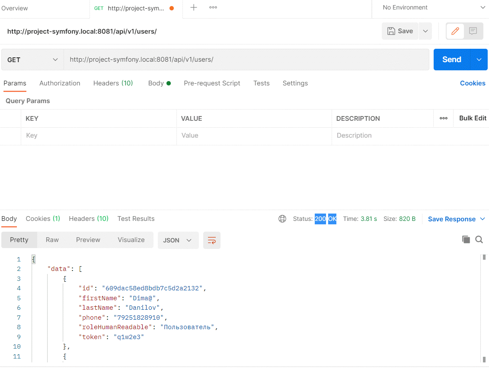
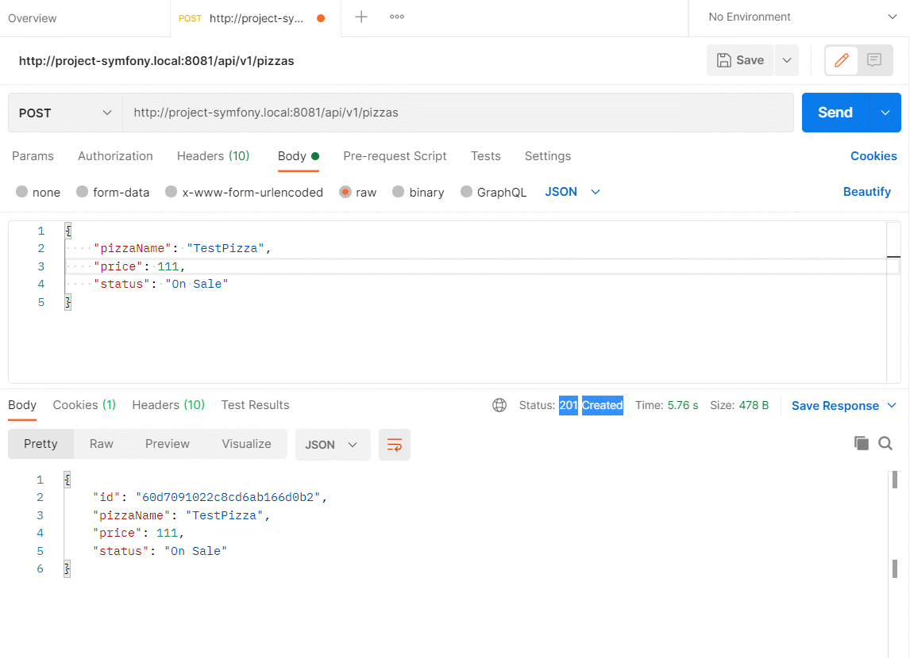
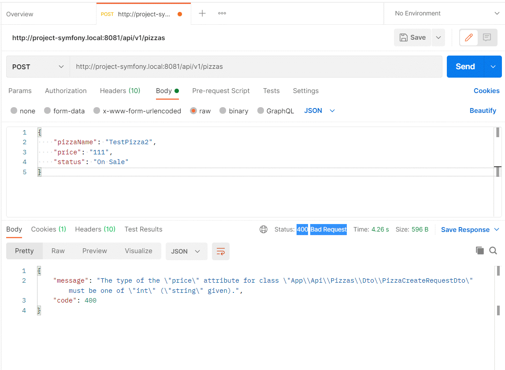
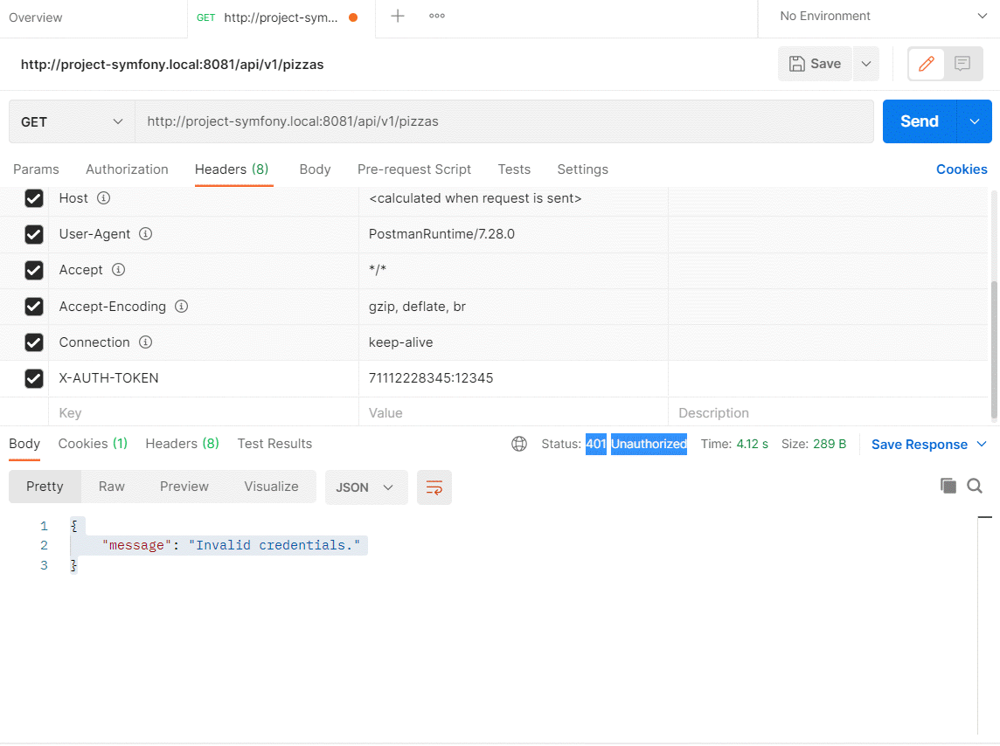
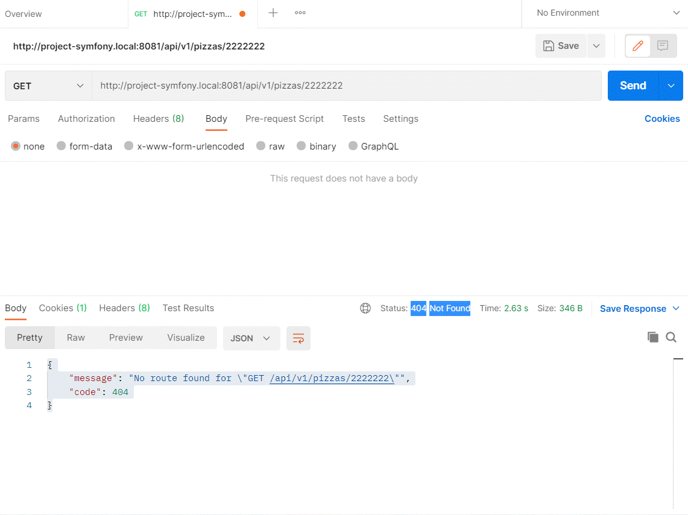
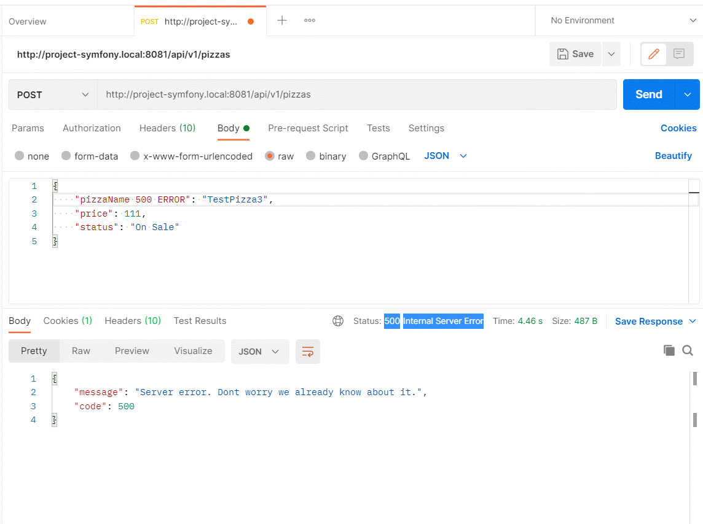

# Рубежный контроль
### Выполнил: Данилов Дмитрий 191-321
### Вопрос
*Какие HTTP коды ответов бывают. Рассказать на какие группы они делятся. На примере разработанного апи описать кейсы, когда возникают те или иные виды кодов ответа: по 3 кейса на группу, для 3х групп.*

---
### Ответ
**Код состояния HTTP** — часть первой строки ответа сервера при запросах по протоколу HTTP. Он представляет собой целое число из трёх десятичных цифр. Первая цифра указывает на класс состояния(1-5). После кода идёт описание самой ошибки для простоты пользователя.
 
На данный момент выделяют 5 групп ошибок:

| Код ответа | Тип ошибки | Предназначение |
|:----------:|:----------:| ---------------|
| 1**        | Informational(Информационные) | В этот класс выделены коды, информирующие о процессе передачи. |
| 2**        | Successful(Успех)             | Сообщения данного класса информируют о случаях успешного принятия и обработки запроса клиента. |
| 3**        | Redirection(Перенаправление)  | Коды этого класса сообщают клиенту, что для успешного выполнения операции необходимо сделать другой запрос. |
| 4**        | Client Error(Ошибка клиента)  | Класс предназначен для указания ошибок со стороны клиента. |
| 5**        | Server Error(Ошибка сервера)  | Коды класса предназначены под случаи необработанных исключений при выполнении операций на стороне сервера. |

### Примеры
Запросы показаны на примере API с [пиццей (Ссылка на API)](https://github.com/DimaDanilov/docker-project1/tree/lab9 "API пицца (9 лабораторная)")

### 200
Запрос успешно обработан. Появление зависит от метода. На примере моего API можно получить код 200 при выполнении GET со следующими данными

http://project-symfony.local:8081/api/v1/users



### 201
"Создано". Запрос успешно выполнен и в результате был создан ресурс.

На примере моего API можно создать пиццу с нужными данными, например:

http://project-symfony.local:8081/api/v1/pizzas

```JSON
{
    "pizzaName": "TestPizza",
    "price": 111,
    "status": "On Sale"
}
```



### 400
"Плохой запрос". Этот ответ означает, что сервер не понимает запрос из-за неверного синтаксиса.

На примере моего API 400 может появиться при введении неверного типа данных (цена должна быть int, а не string):

http://project-symfony.local:8081/api/v1/pizzas

```JSON
{
  "pizzaName": "TestPizza2",
  "price": "111",
  "status": "On Sale"
}
```



### 401
"Неавторизованно". Для получения запрашиваемого ответа нужна аутентификация. Статус похож на статус 403, но,в этом случае, аутентификация возможна.

На примере моего API для появления ошибки 401 можно зайти под несуществующим пользователем и выполнить любой запрос, например GET:

http://project-symfony.local:8081/api/v1/pizzas



(Пользователя с таким номером телефона не существует)

### 404
"Не найден". Сервер не может найти запрашиваемый ресурс.

На примере моего API 404 может появиться например при запросе GET пиццы, которой не существует:

http://project-symfony.local:8081/api/v1/pizzas/2222222

```JSON
{
  "message": "No route found for \"GET /api/v1/pizzas/2222222\"",
  "code": 404
}
```
Пиццы с id 2222222 не существует и он выдает ошибку 404.



### 500
"Внутренняя ошибка сервера". Сервер столкнулся с ситуацией, которую он не знает как обработать.

500 можно получить например, если попытаться сделать POST в несуществующее поле БД:

http://project-symfony.local:8081/api/v1/pizzas

```JSON
{
  "pizzaName 500 ERROR": "TestPizza3",
  "price": 111,
  "status": "On Sale"
}
```



---
### Источники
https://www.w3.org/Protocols/rfc2616/rfc2616-sec10

https://developer.mozilla.org/ru/docs/Web/HTTP/Status

https://ru.wikipedia.org/wiki/Список_кодов_состояния_HTTP
